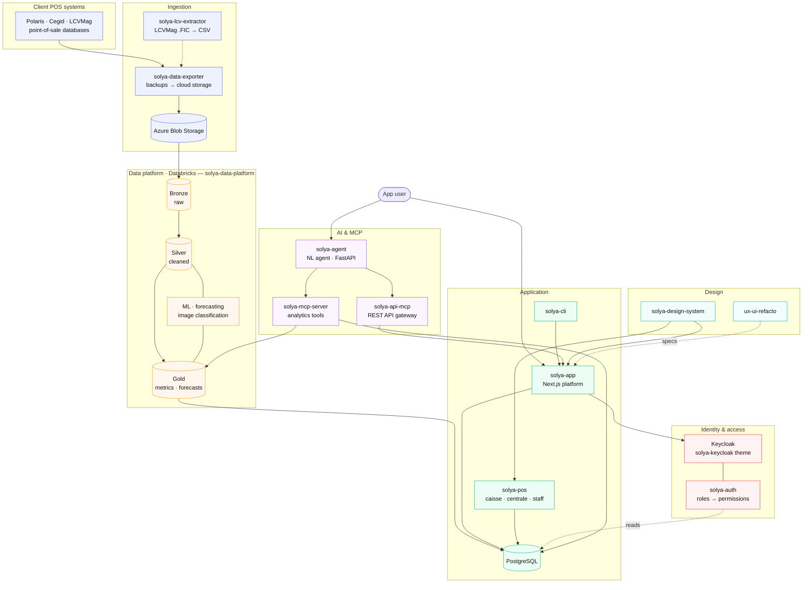

# Solya

Retail intelligence platform — inventory, point-of-sale, analytics and AI for fashion retail.

This organization is split into focused repositories. Every repo is tagged with
[topics](https://github.com/search?q=org%3ASolya-app+topic%3Asolya&type=repositories) so you can
filter by domain or type.

**Filter by topic:**
[`solya`](https://github.com/orgs/Solya-app/repositories?q=topic%3Asolya) (all) ·
[`data`](https://github.com/orgs/Solya-app/repositories?q=topic%3Adata) ·
[`ai`](https://github.com/orgs/Solya-app/repositories?q=topic%3Aai) ·
[`mcp`](https://github.com/orgs/Solya-app/repositories?q=topic%3Amcp) ·
[`gtm`](https://github.com/orgs/Solya-app/repositories?q=topic%3Agtm) ·
[`auth`](https://github.com/orgs/Solya-app/repositories?q=topic%3Aauth) ·
[`infra`](https://github.com/orgs/Solya-app/repositories?q=topic%3Ainfra) ·
[`design-system`](https://github.com/orgs/Solya-app/repositories?q=topic%3Adesign-system)

---

## 🛍️ Core product & apps

| Repo | What it is |
|------|------------|
| [solya-app](https://github.com/Solya-app/solya-app) | Fashion retail inventory & management platform (Next.js) |
| [solya-pos](https://github.com/Solya-app/solya-pos) | Point-of-sale apps — Turborepo + pnpm, strict TypeScript |
| [solya-auth](https://github.com/Solya-app/solya-auth) | Platform authorization (authZ) service — Keycloak-backed |

## 📊 Data & analytics

| Repo | What it is |
|------|------------|
| [solya-data-platform](https://github.com/Solya-app/solya-data-platform) | Retail analytics data platform — ETL Bronze→Silver→Gold, forecasting & BI |
| [solya-data-exporter](https://github.com/Solya-app/solya-data-exporter) | Windows GUI/CLI to upload Polaris backups to Azure/Scaleway |
| [solya-lcv-extractor](https://github.com/Solya-app/solya-lcv-extractor) | Pure-Python parser for LCVMag HFSQL (.FIC) files to CSV |

## 🤖 AI & MCP

| Repo | What it is |
|------|------------|
| [solya-agent](https://github.com/Solya-app/solya-agent) | AI agent for natural-language querying of retail data |
| [solya-mcp-server](https://github.com/Solya-app/solya-mcp-server) | MCP server exposing Solya analytics tools |
| [solya-api-mcp](https://github.com/Solya-app/solya-api-mcp) | MCP gateway over the Solya REST API (~119 ops, 3 tools) |

## 🧰 Libraries & tooling

| Repo | What it is |
|------|------------|
| [solya-cli](https://github.com/Solya-app/solya-cli) | Auto-generated CLI for the Solya API (from OpenAPI) |
| [solya-python-utilities](https://github.com/Solya-app/solya-python-utilities) | Shared Python utilities (Azure Blob, helpers) |
| [sparkless](https://github.com/Solya-app/sparkless) | Lightweight PySpark replacement — tests 10x faster, no JVM |

## 🏗️ Infrastructure & platform

| Repo | What it is |
|------|------------|
| [solya-infra](https://github.com/Solya-app/solya-infra) | Infrastructure as Code for Solya's cloud & deployments |
| [solya-keycloak](https://github.com/Solya-app/solya-keycloak) | Custom Keycloak theme for Solya |

## 🎨 Design & UX

| Repo | What it is |
|------|------------|
| [solya-design-system](https://github.com/Solya-app/solya-design-system) | Shared design system bridging Figma and code |
| [ux-ui-refacto](https://github.com/Solya-app/ux-ui-refacto) | UX/UI redesign of solya-app — one folder per feature |

## 🚀 Go-To-Market

| Repo | What it is |
|------|------------|
| [go-to-market](https://github.com/Solya-app/go-to-market) | Umbrella repo for Solya's agentic ABM / GTM system |
| [gtm-outbound](https://github.com/Solya-app/gtm-outbound) | Agentic GTM outbound — Claude Code prospecting commands |
| [gtm-partnership](https://github.com/Solya-app/gtm-partnership) | Solya GTM — Partnership channel |
| [gtm-seo-geo](https://github.com/Solya-app/gtm-seo-geo) | Solya GTM — SEO/GEO channel |
| [solya-outbound-plugin](https://github.com/Solya-app/solya-outbound-plugin) | Claude Code plugin for Solya outbound GTM |

## 📚 Docs, site & ops

| Repo | What it is |
|------|------------|
| [solya-website](https://github.com/Solya-app/solya-website) | Marketing site for solya.app — bilingual, Next.js + MDX |
| [docs](https://github.com/Solya-app/docs) | Public documentation site (Mintlify) |
| [solya-product-management](https://github.com/Solya-app/solya-product-management) | PM workspace — Notion ↔ GitHub orchestration |
| [.github](https://github.com/Solya-app/.github) | Org profile & shared community-health files |

---

## Architecture overview

From client point-of-sale data to the app, the AI agent and the POS — how the repos fit together.

**Shared libraries** used across the above: [solya-python-utilities](https://github.com/Solya-app/solya-python-utilities) (common helpers) and [sparkless](https://github.com/Solya-app/sparkless) (fast PySpark test replacement). **Go-To-Market**, **website** and **docs** repos are listed in the tables above and sit outside the product runtime.

> This diagram is defined in Mermaid right here in `profile/README.md` — edit the code block to keep it current, no image export needed.
